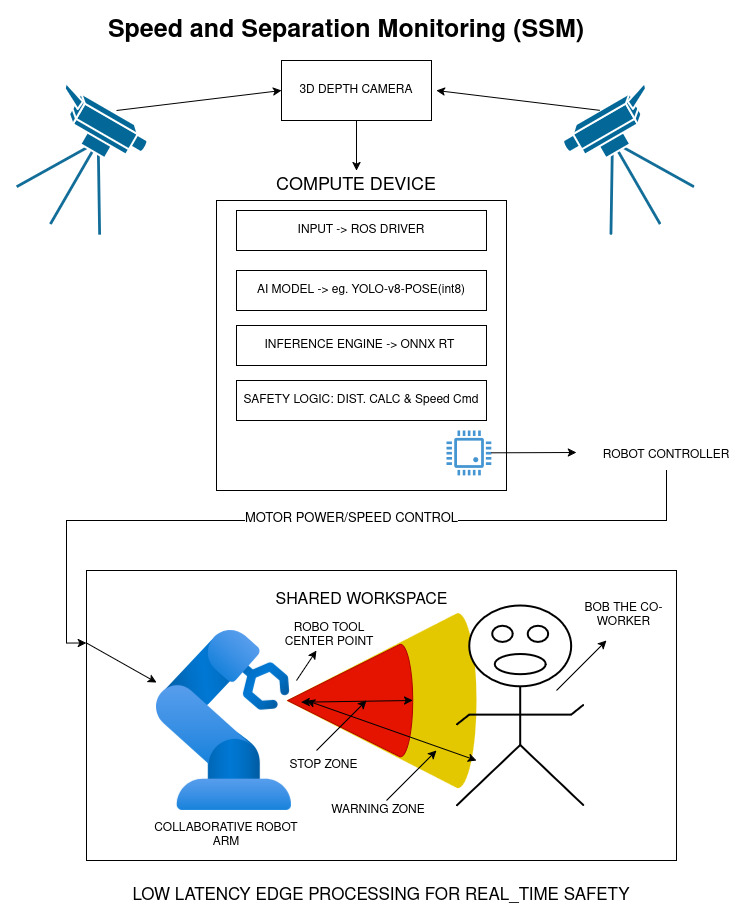

# **Edge AI Architecture for Human-Robot Collaboration**

 
Transitioning from Rigid Safety Fencing to Dynamic Edge AI Safety System.

## **1\. Summary**

Traditional industrial safety relies on physical cages that completely stop production when a human enters the workspace. This "Stop-and-Go" approach kills efficiency. Modern Industry 4.0 standards (ISO/TS 15066\) allow for **Speed and Separation Monitoring (SSM)**, where the robot dynamically slows down or alters its path based on the human's proximity.  
However, relying on Cloud AI for this task introduces dangerous latency. A 100ms network lag could result in an injury before the robot receives the stop command. This report outlines a **High-Performance Edge AI Architecture** that processes skeletal tracking locally (within 15ms), ensuring compliance with safety standards while maintaining high production throughput.

## **2\. System Architecture Design**

The proposed system creates a "Virtual Safety Shield" around the collaborative robot (Cobot). It uses redundant 3D vision to track the human worker's skeletal keypoints (wrists, head, shoulders) in real-time.

### **2.1 Hardware Components**

| Component | Specification | Function |
| :---- | :---- | :---- |
| **Vision Sensors** | **2x Intel RealSense D435i** | **Redundancy & Depth:** Two cameras positioned at opposing angles eliminate "blind spots" (occlusion) caused by the robot's own arm. These provide both RGB and Depth (Point Cloud) data. |
| **Edge Compute** | **NVIDIA Jetson Nano/Orin** | **Local Inference:** A dedicated System-on-Module (SoM)  It processes video streams locally without sending data to the cloud. |
| **Robot Controller** | **Universal Robots Control Box** | **Motion Control:** Receives speed scaling commands (0% to 100%) from the Edge device and executes Safety Stop Category 1 or 2\. |

### **2.2 Software Stack**

* **Input Layer:** ROS 2 (Robot Operating System) nodes capturing raw point cloud data at high fps.  
* **AI Model:** **YOLOv8-Pose**
  * Pose estimation tracks specific joints (e.g., the right wrist). This allows the robot to keep working if the human is nearby but facing away, only stopping if the *hand* reaches toward the danger zone.  
* **Inference Engine: ONNX RT** 
  * This is the critical optimization layer that compiles the generic PyTorch model into a binary engine optimized.
* **Safety Logic:**  
  * A deterministic algorithm that calculates the Euclidean distance between the robot's **Tool Center Point (TCP)** and the nearest **Human Keypoint**.

## **3\. Edge AI Optimization Strategy**

Running a modern computer vision model like YOLOv8-Pose at 30+ FPS on a small embedded device requires aggressive optimization. We cannot use the "heavy" models used in cloud servers.

### **Strategy A: Post-Training Quantization to INT8**

Standard AI models compute using **FP32** (32-bit Floating Point) numbers. This is highly precise but computationally expensive.

* **The Technique:** We convert the model weights and activations to **INT8** (8-bit Integers).  
* **Implementation:** Using the TensorRT calibrator, we pass a small dataset of "representative images" through the model. The calibrator determines the dynamic range of activation values and maps them to the \-128 to \+127 integer range.  
* **Benefit:** This reduces memory bandwidth usage by **4x** and inference time is lot faster.

### **Strategy B: Structured Pruning**

Many neural networks are "over-parameterized," containing neurons that contribute little to the final output.

* **The Technique:** We use **Structured Pruning** (Channel Pruning). Unlike *unstructured* pruning (which makes matrices sparse but doesn't necessarily speed up hardware), structured pruning removes entire filters (channels) from the Convolutional layers.  
* **Implementation:** We identify channels with the lowest L1-norm (least impact) and physically remove them from the network architecture, effectively creating a "thinner" model.  
* **Benefit:** This directly reduces the number of FLOPs (Floating Point Operations) required for inference, lowering latency.

## **4\. Impact Analysis: Cloud vs. Edge**

According to ISO 13855, the Minimum Safety Distance (S) is calculated as:

$$S = (K \times T) + C$$

* $K$: Human approach speed (1600 mm/s).  
* $T$: Total system stopping time (Latency \+ Braking time).

**If Latency (**$T$**) increases, the Safety Distance (**$S$**) must increase, forcing the robot to stop when the human is still far away, ruining productivity.**

**Note: metrics are relative to each other**
| Metric | Cloud Solution (Standard) | Edge AI Solution (Optimized) | Impact Analysis |
| :---- | :---- | :---- | :---- |
| **Total Latency (**$T$**)** | **HIGH** (Network RTT \+ Inference) | **LOW** (Local Capture \+ Inference) | Reducing $T$ allows the robot to work much closer to the human without violating safety zones. |
| **Energy** | **HIGH**(server side) | **LOW** | Compute devices like Jetson runs on low voltage, easily integrated into the robot's power supply without expensive cooling. |
| **Model Accuracy** | **HIGH** | **LOW** | The precision loss from INT8 quantization is negligible for detecting a large object like a human arm at close range. |

## **5\. Risk Assessment:**

While optimization is necessary, aggressive compression introduces specific safety risks that must be mitigated.

### **Risk 1: "The Ghost Effect" (False Negatives)**

**Description:** Aggressive **Pruning** removes "redundant" features. In rare edge cases—such as a worker wearing a grey shirt lying on a grey floor—the compressed model might lack the feature extractors necessary to distinguish the arm from the background.

* **Consequence:** The system fails to detect the human (False Negative), and the robot does not stop.

### **Risk 2: "The Jitter Effect" (Temporal Instability)**

**Description:** **Quantization** (INT8) introduces rounding errors. While accurate on average, the detected coordinate of a wrist might jump by 5-10cm between frames even if the human is still.

* **Consequence:** The robot controller receives erratic distance data, causing the robot to "stutter" (rapidly braking and accelerating).

## **6\. Conclusion**

By deploying a **Quantized and Pruned YOLOv8-Pose model** on an **Edge device**, we can achieve a safety system that is compliant with **ISO/TS 15066**. This architecture solves the latency issues of cloud computing, enabling an environment where humans and robots work in close proximity without physical barriers. 